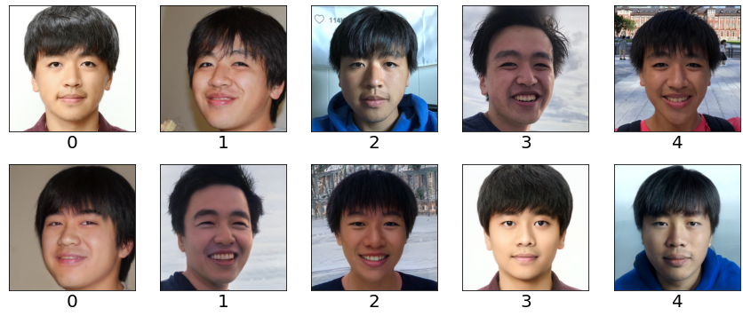
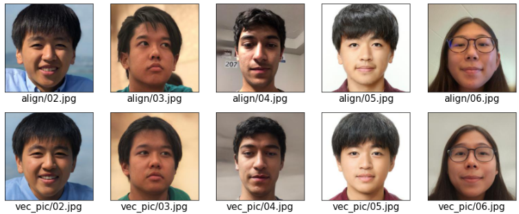

# __Animorphs__

## __Project Outline__ 
Our goal is to make a model architecture that can morph one object into another. We input two images (start and goal image) and output and the main task of our model is to use their latent space vectors of the two images to come up with intermediary latent vectors. We then use the latent vectors to generate intermediate images. Finally, we will string together the start, intermediate images, and goal image to make a smooth .gif-like animation.

## __Model Architecture__ 
For this project, we mainly used two models, styleGAN and styleGAN2.
### __Style Generative Adversarial Network(styleGAN)__
The first model we used for human faces dataset and WikiArt dataset is styleGAN created by NVIDIA. The model has the following architecture:

Unlike traditional GAN where we get the latent vector from feed forward network, styleGAN gets the latent vector by using two different networks, mapping network and synthesis network. For the mapping network, style-based Generator uses 8-layer MLP. The output from the mapping network is a vector that defines the styles that is integrated at each point in the generator model via a new layer called adaptive instance normalization(AdaIN), which is defined as:
$$\begin{align}
AdaIN(x_{i}, y) = y_{s,i} \frac{x_{i}-\mu(x_{i})}{\sigma(x_i)} + y_{b,i}
\end{align}$$ 
where $y_{s}, y_{b}$ are styles learned in the affine transformation.
The use of this style vector gives control over the style of the generated image. The AdaIN layers involve first standardizing the output of feature map to a standard Gaussian, then adding the style vector as a bias term.
This unique architecture allows us to have a control over the style of generated images at different levels of detail.

## __Dataset__
### __Human Faces Dataset__
- For human faces, we take advantage of the pre-trained styleGAN model built by NVIDIA. Since we can generate an image from any vector now, the image generation part was taken care of. Now we had to encode our start and goal images to obtain the intermediary latent vectors. We try to approximate using two methods.
#### __Latent Vector Approximation using MSE__
- This is our first naive approach where the steps are described below.
  1. Initialize a random vector, $w$, of dimension $[1, 18, 512]$ and minimal loss vector $w_{min}$ of same dimension to $\vec{0}$ (only in the first iteration)
  2. Pass in the vector, $w$, to generator $G$ of styleGAN model.
  3. Compare the image $I_{w}$, the original image, and the generated image, $I_{G(w)}$, using MSE loss.
  4. If the loss is the smallest we have seen so far, do the update, $w_{min} = w$ and go back to step 1.
   
- With this method we were able to achieve the results below with five input images.

(0 maps to 3, 1 -> 0, 2 -> 4, 3 -> 1, 4 -> 2)

#### __Latent Vector Approximation using e4e__
- This new technique, which was published [here](https://arxiv.org/pdf/2102.02766.pdf), is a more generalized version where if you pass in an image, you can immediately get its latent vector (Note that our first approach requires us to compute one image at a time so it is very inefficient hence naive). The model structure is as follows:
 
- The steps are:
  - You pass in an image to the encoder, $E$, and it outputs a latent vector, $w$, and $N$ offsets (for face $N=18$, which is the size of second dimension), $\delta$. We combine these two 
  and pass it into the generator $G$ of pretrained styleGAN model.
  - We again compute the MSE loss of the original image and generated image. However, at the same time, we also set the loss for our offsets $\delta$ and we try to minimize these two losses.
  - We update the learnable parameters in the encoder, $E$.
  
- With this method the following results were achieved:
  

### __WikiArt Dataset__
- For WikiArt Dataset, since we did not have a pre-trained styleGAN model published by NVIDIA, we attempted to train our own model using Google Cloud Platform.
- We used the WikiArt dataset on Kaggle that is available [here](https://www.kaggle.com/competitions/painter-by-numbers/data).
- We tried following the steps listed in the README.md of the [official styleGAN implementation](https://github.com/NVlabs/stylegan) and trained the network with 4 GPUs. However, on the third day, our GCP crashed and all the weights were loss and we decided to use this [checkpoint](https://mega.nz/file/PsIQAYyD#g1No7FDZngIsYjavOvwxRG2Myyw1n5_U9CCpsWzQpIo) we came across.
- Using the model obtained from the above checkpoint, here are some results produced by the generator of styleGAN.

- From the results, we can see that the model performs pretty well in producing impressionist/nature-inspired art. However, when we take a look at the portrait arts produced by the generator, we can immediately observe that the face and body of the person depicted are warped and distorted.

## Morphing 
- To be able to morph from one image to another, we researched ways to combine latent vectors. We decided to use linear interpolation to calculate intermediary vectors between two image coordinates. The formula for `linear interpolation` is defined as such:
$$\begin{align}
w_i = \alpha w_1 + (1-\alpha) w_2
\end{align}$$
- where $\alpha$ is the interpolation factor and $w_i$ is the interpolation vector. ($w_1$ and $w_2$ are the two latent vectors, one for start image and the other for goal image.) By running the generator on several $\alpha$ values, we can get same number of intermediary images, and by connecting them, obtain a smooth animation. 

### __Human Face Morphing__
- Using the 5 approximated images obtained in the naive method for Human Face, the following morphing was achieved:
  

- Additionally, with encoder4editor, we were now able to explore the latent space of the human faces dataset and 'edit' our image in certain directions. For our project, we have made it so that we can edit `age`, `pose`, and `age + pose` attributes.

Moving in `age` direction:

Moving in `pose` direction:

Moving in `age + pose` direction:

### __WikiArt Morphing__
- The following is the result of morphing various WikiArt images using `linear interpolation`(left is the start image, right is the goal image):

Morphing 1:

start and end images

result morphing

Morphing2:

start and end images

result morphing

